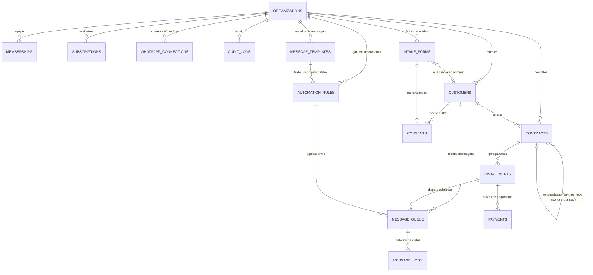

# Modelo do banco de dados — ATLAS NOVA ERA

Este documento é a "planta" do banco antes de criarmos qualquer tabela de verdade.
Leia, peça ajustes se algo não fizer sentido para o seu negócio, e só depois
transformamos isso em tabelas reais no Supabase.

## Ideia central: tudo pertence a uma organização

Cada empresa que assina o ATLAS NOVA ERA vira uma linha em `organizations`.
Quase todas as outras tabelas têm uma coluna `organization_id` dizendo "isso é
de qual empresa". Uma regra de segurança do banco (chamada RLS — Row Level
Security) trava qualquer leitura ou escrita fora da organização da pessoa
logada, mesmo que exista um erro de programação no site. É a "parede" entre
os dados de um assinante e os de outro.

## Diagrama (visão geral dos relacionamentos)

Em palavras simples, os 15 "blocos" se agrupam em 4 áreas:

1. **Conta e equipe** — `organizations`, `memberships`, `subscriptions`, `audit_logs`
2. **Clientes e captação** — `customers`, `intake_forms`, `consents`
3. **Contratos e dinheiro** — `contracts`, `installments`, `payments`
4. **Cobrança automática** — `message_templates`, `automation_rules`, `message_queue`, `message_logs`, `whatsapp_connections`, `whatsapp_messages`

---

## 1. Conta e equipe

### `organizations`
A empresa assinante (o "cliente do ATLAS").
| Coluna | Tipo | Observação |
|---|---|---|
| id | uuid | chave primária |
| name | text | nome da empresa/loja |
| cnpj | text | opcional |
| phone | text | opcional |
| pix_key | text | chave Pix padrão, usada na variável `{{chave_pix}}` das mensagens |
| pix_city | text | cidade do recebedor, exigida pelo padrão Pix pra montar o código "Copia e Cola" (`{{pix_copia_cola}}`) |
| intake_slug | text, único | define o link público `/c/[slug]` da ficha de cadastro |
| created_at / updated_at | timestamptz | |

### `memberships`
Quem trabalha em cada organização e com qual papel.
| Coluna | Tipo | Observação |
|---|---|---|
| id | uuid | |
| organization_id | uuid → organizations | |
| user_id | uuid → auth.users | nulo enquanto o convite não foi aceito |
| role | text | `owner` \| `manager` \| `operator` |
| status | text | `invited` \| `active` \| `removed` |
| invited_email | text | usado antes do convite ser aceito |
| created_at | timestamptz | |

Regra de papéis (do seu briefing):
- **Dono (owner):** tudo, inclusive assinatura, chave Pix e WhatsApp.
- **Gestor (manager):** tudo do dia a dia + renegociar, estornar e cancelar.
- **Operador (operator):** clientes, fichas, conversas e baixa de pagamento.

### `subscriptions`
O status do pagamento da própria organização (assinatura do ATLAS).
| Coluna | Tipo | Observação |
|---|---|---|
| id | uuid | |
| organization_id | uuid → organizations, único | |
| asaas_customer_id | text | |
| asaas_subscription_id | text | Mensal/Anual (recorrente) |
| asaas_payment_id | text | Vitalício (cobrança única) |
| plan | text | `monthly` \| `annual` \| `lifetime` |
| status | text | `trialing` \| `active` \| `past_due` \| `canceled` \| `lifetime` |
| trial_ends_at | timestamptz | |
| current_period_end | timestamptz | |
| created_at / updated_at | timestamptz | |

### `audit_logs`
Quem fez o quê (trilha de auditoria), nunca é apagado.
| Coluna | Tipo | Observação |
|---|---|---|
| id | uuid | |
| organization_id | uuid → organizations | |
| user_id | uuid → auth.users | nulo quando a ação foi automática (cron) |
| action | text | ex.: `installment.paid`, `contract.created` |
| entity_type / entity_id | text / uuid | o que foi afetado |
| before / after | jsonb | estado antes/depois, para consulta futura |
| created_at | timestamptz | |

---

## 2. Clientes e captação

### `customers`
| Coluna | Tipo | Observação |
|---|---|---|
| id | uuid | |
| organization_id | uuid → organizations | |
| name | text | |
| cpf | text | só dígitos, dígito verificador validado no formulário |
| whatsapp | text | formato E.164 (ex.: `+5511999998888`) |
| email | text | opcional |
| cep, address_* | text | endereço, preenchido via ViaCEP |
| tags | text[] | |
| notes | text | |
| automation_paused | boolean | vira `true` se o cliente responder "PARAR"/"SAIR" |
| created_by | uuid → auth.users | |
| created_at / updated_at | timestamptz | |

### `intake_forms`
Cada envio do formulário público `/c/[slug]` (a "ficha").
| Coluna | Tipo | Observação |
|---|---|---|
| id | uuid | |
| organization_id | uuid → organizations | |
| status | text | `received` \| `in_review` \| `approved` \| `rejected` |
| name, cpf, whatsapp, email, cep, address_* | — | mesmos dados de `customers`, preenchidos pelo próprio interessado |
| customer_id | uuid → customers, nulo | preenchido quando aprovada com 1 clique |
| reviewed_by | uuid → auth.users | |
| reviewed_at | timestamptz | |
| created_at | timestamptz | |

### `consents`
Prova do aceite da LGPD (obrigatório por lei guardar isso).
| Coluna | Tipo | Observação |
|---|---|---|
| id | uuid | |
| organization_id | uuid → organizations | |
| intake_form_id | uuid → intake_forms, nulo | |
| customer_id | uuid → customers, nulo | |
| terms_version | text | qual versão do termo foi aceita |
| accepted_at | timestamptz | |
| ip_address | text | |
| user_agent | text | |

---

## 3. Contratos e dinheiro

**Tudo em centavos (número inteiro), nunca em número decimal solto.**
Ex.: R$ 1.234,56 é guardado como `123456`.

### `contracts`
| Coluna | Tipo | Observação |
|---|---|---|
| id | uuid | |
| organization_id | uuid → organizations | |
| customer_id | uuid → customers | |
| principal_amount_cents | bigint | valor total emprestado |
| installments_count | int | número de parcelas |
| periodicity | text | `weekly` \| `biweekly` \| `monthly` |
| first_due_date | date | |
| installment_amount_cents | bigint | valor de cada parcela |
| late_fee_percent | numeric | multa (%) |
| late_interest_monthly_percent | numeric | juros de mora ao mês, calculado por dia de atraso |
| status | text | `active` \| `completed` \| `renegotiated` \| `canceled` |
| renegotiated_from_contract_id | uuid → contracts, nulo | aponta para o contrato original |
| created_by | uuid → auth.users | |
| created_at / updated_at | timestamptz | |

### `installments`
| Coluna | Tipo | Observação |
|---|---|---|
| id | uuid | |
| contract_id | uuid → contracts | |
| organization_id | uuid → organizations | repetido aqui para a regra de segurança funcionar sozinha |
| number | int | 1, 2, 3... |
| due_date | date | |
| amount_cents | bigint | valor original da parcela |
| status | text | `pending` \| `partially_paid` \| `paid` \| `renegotiated` \| `reversed` |
| paid_amount_cents | bigint | soma dos pagamentos ativos |
| created_at / updated_at | timestamptz | |

Os selos visuais "Vence hoje", "Atrasada" e "A vencer" **não ficam guardados**
— são calculados na hora, comparando `due_date` com a data de hoje, só para
parcelas com status `pending`/`partially_paid`. Isso evita que o selo fique
desatualizado.

O **valor atualizado** (parcela + multa + juros pelos dias de atraso) também
não é guardado: é sempre calculado por uma única função (`calcularValorAtualizado`),
com testes automáticos, usada tanto na tela quanto nas mensagens de cobrança.

### `payments`
Cada baixa (inclusive parciais) vira uma linha aqui — é o "extrato" da parcela.
| Coluna | Tipo | Observação |
|---|---|---|
| id | uuid | |
| organization_id | uuid → organizations | |
| installment_id | uuid → installments | |
| amount_cents | bigint | |
| paid_at | timestamptz | |
| method | text | `pix` \| `dinheiro` \| `transferencia` \| `cartao` |
| reversed_at / reversed_reason | timestamptz / text | preenchidos no estorno |
| created_by | uuid → auth.users | |
| created_at | timestamptz | |

---

## 4. Cobrança automática pelo WhatsApp

### `message_templates`
| Coluna | Tipo | Observação |
|---|---|---|
| id | uuid | |
| organization_id | uuid → organizations | |
| name | text | |
| body | text | com variáveis `{{nome}}`, `{{valor_parcela}}`, etc. |
| active | boolean | |
| created_at / updated_at | timestamptz | |

### `automation_rules`
Os gatilhos que ligam/desligam, cada um com seu horário.
| Coluna | Tipo | Observação |
|---|---|---|
| id | uuid | |
| organization_id | uuid → organizations | |
| trigger_type | text | `reminder_before` \| `due_today` \| `overdue_after` \| `renegotiation_offer` \| `payment_confirmation` \| `contract_created` |
| days_offset | int | "X dias antes/depois", quando se aplica |
| template_id | uuid → message_templates | |
| active | boolean | |
| send_window_start/end | time | padrão 08:00–20:00 |
| skip_sunday | boolean | padrão `true` |

### `message_queue`
A fila: o que está agendado para ser enviado.
| Coluna | Tipo | Observação |
|---|---|---|
| id | uuid | |
| organization_id | uuid → organizations | |
| customer_id | uuid → customers | |
| installment_id | uuid → installments, nulo | nulo em gatilhos que não são de parcela |
| automation_rule_id | uuid → automation_rules, nulo | set to null when the rule is deleted (history is kept) |
| template_id | uuid → message_templates, nulo | set to null when the template is deleted (history is kept) |
| trigger_type | text | |
| scheduled_for | timestamptz | |
| rendered_body | text | mensagem já com as variáveis preenchidas (uma "foto" do texto no momento do agendamento) |
| status | text | `scheduled` \| `sent` \| `delivered` \| `read` \| `failed` \| `canceled` |
| attempts | int | |

**Trava contra cobrança em dobro:** existe uma restrição única no banco em
`(installment_id, trigger_type, data do dia agendado)`. Ou seja, é fisicamente
impossível a mesma parcela receber o mesmo tipo de cobrança duas vezes no
mesmo dia — mesmo que o robô rode duas vezes por engano.

**Deleting a rule or template:** messages still `scheduled` for it are
switched to `canceled` before the delete, so nothing is sent for a rule or
template that no longer exists. A template still used by a rule cannot be
deleted — delete the rule first.

### `message_logs`
Histórico de cada mudança de status de uma mensagem (uma linha por evento).
| Coluna | Tipo | Observação |
|---|---|---|
| id | uuid | |
| organization_id | uuid → organizations | |
| queue_id | uuid → message_queue | |
| status | text | `scheduled` \| `sent` \| `delivered` \| `read` \| `failed` |
| provider_message_id | text | id da mensagem no WhatsApp |
| error | text | motivo, se falhou |
| occurred_at | timestamptz | |

### `whatsapp_connections`
| Coluna | Tipo | Observação |
|---|---|---|
| id | uuid | |
| organization_id | uuid → organizations, único | uma conexão por empresa |
| provider | text | decidimos juntos na Fase 5 |
| status | text | `disconnected` \| `connecting` \| `connected` \| `error` |
| phone_number | text | |
| credentials_ref | text | nunca a senha/token em texto puro — referência a um cofre de segredos |
| connected_at | timestamptz | |

### `whatsapp_messages`
Mensagens de WhatsApp trocadas com o cliente (Central de conversas, Fase 6)
— diferente de `message_queue`, que é só a fila de cobrança automática.
| Coluna | Tipo | Observação |
|---|---|---|
| id | uuid | |
| organization_id | uuid → organizations | |
| customer_id | uuid → customers, nulo | nulo quando a mensagem chega de um número sem cliente cadastrado ainda |
| direction | text | `inbound` (o cliente mandou) \| `outbound` (o time respondeu) |
| body | text | texto da mensagem; mídia (foto/áudio/documento) vira um aviso de placeholder |
| customer_phone_digits | text | DDD+número do lado do cliente, sem `55`/`+` |
| provider_message_id | text, único | id da mensagem na Meta — trava a mesma entrega de webhook de duplicar |
| occurred_at | timestamptz | |

**Janela de 24h:** a Meta só deixa mandar texto livre até 24h depois da
última mensagem recebida do cliente — depois disso, só reiniciando com um
modelo aprovado (mesmo mecanismo de `message_templates`). Isso é recalculado
a cada envio, nunca guardado como um estado à parte.

---

## Segurança (RLS) — resumo

Toda tabela acima (exceto `organizations`) tem `organization_id`. A regra é
sempre a mesma ideia:

> "Só pode ler/escrever se eu tiver um vínculo (`membership`) ativo com essa
> organização."

Algumas ações ficam mais restritas por papel (ex.: só `owner`/`manager` pode
estornar ou renegociar) — isso é reforçado tanto na regra do banco quanto na
tela, para nunca depender só do que o JavaScript do navegador permite.

## Status

As tabelas foram criadas como arquivos de migração em `supabase/migrations/`
(RLS e regras de segurança já incluídas). Elas só passam a existir de
verdade quando você tiver um projeto Supabase — veja "Aplicando as
migrações" no [README.md](../README.md).

Um teste automatizado (`npm run test:db`) sobe um banco temporário, aplica
essas migrações e confere: (1) uma organização nunca vê dado de outra, (2)
papéis diferentes têm permissões diferentes (operador não decide crédito
nem estorna), e (3) a mesma parcela nunca recebe a mesma cobrança duas
vezes no mesmo dia.
